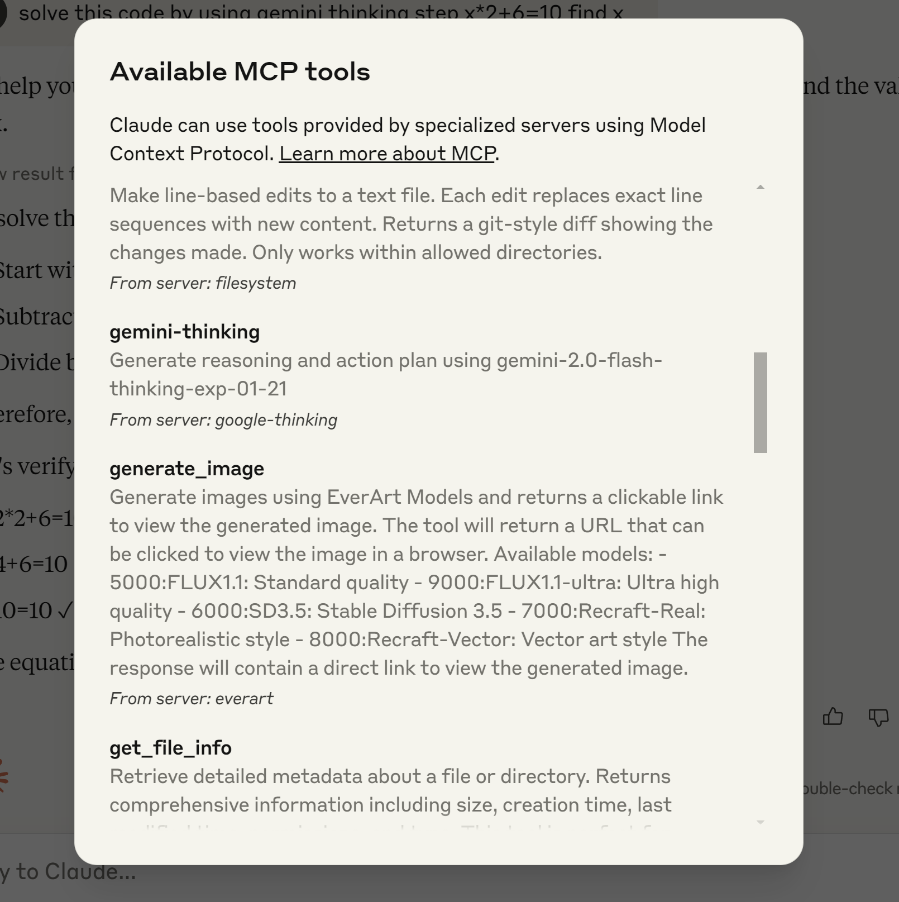
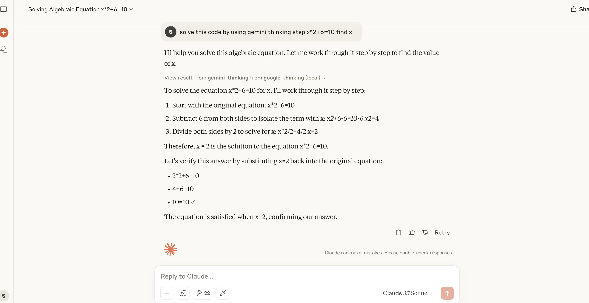

# Gemini Thinking MCP Server
[](https://smithery.ai/server/@falahgs/gemini-thinking-mcp)

A Model Context Protocol (MCP) server implementation for the Google Gemini language model. This server allows Claude Desktop users to access the powerful reasoning capabilities of Gemini-2.0-flash-thinking-exp-01-21 model.

## What is Gemini Flash?

Gemini-2.0-flash-thinking-exp-01-21 is a specialized version of Google's Gemini model that's optimized for fast responses while maintaining high quality. It excels at:

- Mathematical reasoning
- Logical deduction
- Step-by-step analysis
- Structured thinking

## Installation

### Installing via Smithery

To install gemini-thinking-mcp for Claude Desktop automatically via [Smithery](https://smithery.ai/server/@falahgs/gemini-thinking-mcp):

```bash
npx -y @smithery/cli install @falahgs/gemini-thinking-mcp --client claude
```

### Prerequisites

- Node.js (v18 or higher)
- npm
- Claude Desktop
- Google Gemini API key

### Setup

1. Clone this repository:
```bash
git clone https://github.com/falahgs/gemini-thinking-mcp.git
cd gemini-thinking-mcp
```

2. Install dependencies:
```bash
npm install
```

3. Create a `.env` file with your Google API key:
```
GEMINI_API_KEY=your-api-key-here
```

4. Build the project:
```bash
npm run build
```

## Configuring Claude Desktop

To use this MCP server with Claude Desktop, update your Claude Desktop configuration:

1. Locate your Claude Desktop config file:
   - Windows: `%APPDATA%\Claude\claude_desktop_config.json`
   - macOS: `~/Library/Application Support/Claude/claude_desktop_config.json`

2. Add the following to the `mcpServers` section:
```json
"gemini-thinking": {
    "command": "node",
    "args": ["/path/to/gemini-thinking-mcp/build/index.js"],
    "env": {
        "GEMINI_API_KEY": "your-api-key"
    }
}
```

3. Restart Claude Desktop to apply the changes.

## Usage

Once configured, you can access the Gemini model in your Claude Desktop conversations:

```
@gemini-thinking Can you help me solve this math problem step by step?
```

### Parameters

You can adjust the model parameters:

- `prompt`: Your input text for Gemini (required)
- `max_tokens`: Maximum tokens to generate (default: 8192)
- `temperature`: Controls randomness (default: 0.2)

## Examples

Here are some examples of the Gemini Thinking MCP server setup and usage:

### Example 1: Installing MCP Server

This example shows the process of installing and configuring the Gemini Thinking MCP server in Claude Desktop environment.

### Example 2: Testing Mathematical Problem Solving

A demonstration of the MCP server solving a mathematical equation step by step, showing its problem-solving capabilities.

## Development

```bash
npm run dev     # Watch mode
npm run build   # Build for production
npm start       # Run the server
```

## Contributing

Contributions are welcome! Please feel free to submit a Pull Request.

## License

MIT
